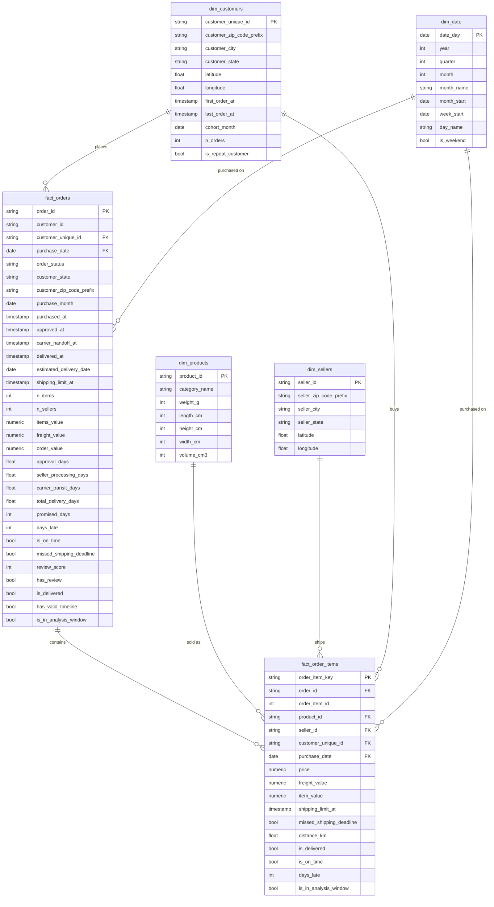

# Star Schema — Entity Relationship Diagram

The marts layer (`dbt/supply_chain/models/marts/`) is a star schema: two fact tables
in the middle, four dimension tables around them.

## Grain and keys

| Table | Grain (one row per…) | Primary key | Rows |
|---|---|---|---|
| `fact_orders` | order | `order_id` | 99,441 |
| `fact_order_items` | item within an order | `order_item_key` (`order_id` + `order_item_id`) | 112,650 |
| `dim_customers` | person | `customer_unique_id` | — |
| `dim_sellers` | seller | `seller_id` | 3,095 |
| `dim_products` | product | `product_id` | 32,951 |
| `dim_date` | calendar day, Sep 2016 – Dec 2018 | `date_day` | — |

## Design decisions

- **Two fact tables at two grains.** Order-level questions (on-time rate, delivery time,
  reviews) use `fact_orders`; item-level questions (sellers, products, freight, distance)
  use `fact_order_items`. Item facts are aggregated to order level *before* joining in
  `int_orders_enriched`, so `fact_orders` never fans out — guarded by a `unique` test on
  `order_id`.
- **`dim_customers` is keyed on the person (`customer_unique_id`), not `customer_id`.**
  Olist issues a new `customer_id` for every order, which would make retention analysis
  impossible. Each person's latest address is kept.
- **No separate geography dimension.** Coordinates (averaged per zip prefix, points
  outside Brazil removed) are folded into `dim_customers` and `dim_sellers`.
- **Fact tables are safe by default.** Delivery metrics (`days_late`, `is_on_time`,
  `total_delivery_days`) are NULL unless the order was delivered; stage durations are NULL
  unless the timeline is in order. A plain `AVG()` in a dashboard is therefore correct
  without extra filters.
- **Distance** is the straight-line distance between seller and customer zip-prefix
  centres (`ST_DISTANCE`), a proxy for shipping distance; 555 items (0.5%) have no
  distance because a zip prefix has no coordinates.

## Relationship tests

Every foreign key above is covered by a dbt `relationships` test, so no fact row points
to a customer, seller, product, or date that does not exist.